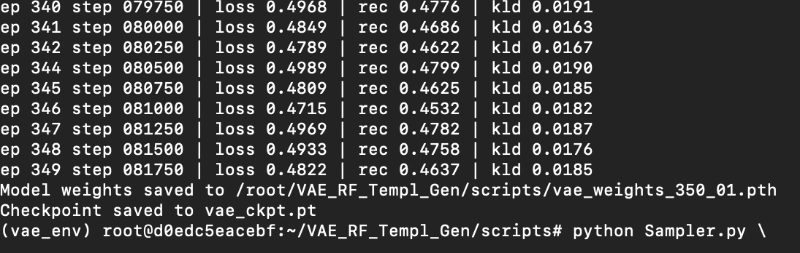
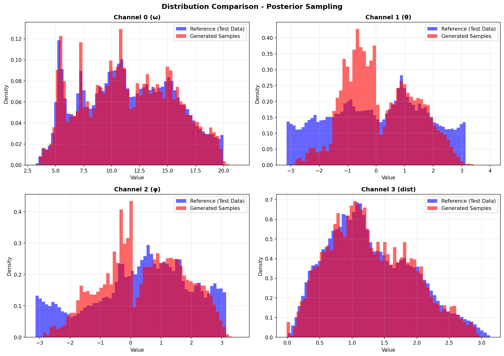
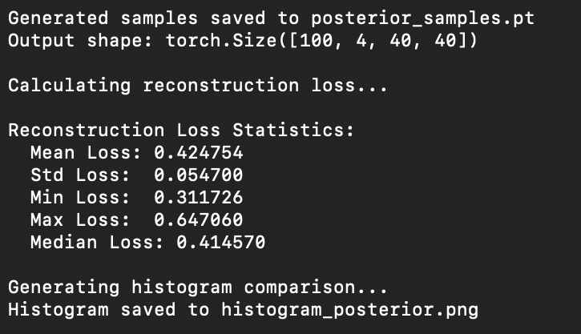

# VAE_RF_Templ_Gen
Protein Conformation Generation via replication of Mansoor, Baker et al., 2024[1]. Using Vanilla VAE and RosettaFold Integration.
## Utility of this Repository
Recent breakthroughs in protein structure prediction have enabled us to predict the structure of proteins without any resolved experimental PDB structure(ab initio folding) utlising evolutionary information through MSA. However, these protein prediction pipelines have been trained on X-ray crystallographic structures of these proteins, bound to have steric hinderances which can only be computationally resolved via MDsim minimisation(a behaviour which is much closer to reality). This shortcoming limit the predictions to a subset of the conformational space which a protein usually explores while carrying out its functions.
This article[1] trained a lightweight VAE for learning the pairwise 4D features which are used by Rosettafold as an intermediate step before 3D reconstruction of the structure. The authors chose KRAS because of its dynamic nature and abundance of MD data in different states(primarily GTP-bound and GDP-bound). The result was the generation of structures of the ligand-bound states when only the apo structures were given as training dataset[1]. 
This repository provides the working code(not provided by the authors) for the replication of their results and an attempt to democraticise GenAI workflows for protein dynamics analysis. At their best, workflows like this can potentially provide us with MD trajectory snapshots much quicker and with much less compute requirements than tools like AMBER and GROMACS.
## Steps of the Workflow:
- Clone this repository:
```
git clone https://github.com/Pratham2405/VAE_RF_Templ_Gen.git
cd VAE_RF_Templ_Gen
cd scripts
```
- Create and activate a virtual environment. This creates a folder `vae_env` in the repo's directory which will contain your venv executables. In case you can't find it, use `find "$HOME" -name "activate" -type f`. This shows the path of the venv directory. To activate it, simply copy the path and give the command: `source "absolute/path/to/your/venv/bin/activate"`:
```
python -m venv vae_env
source vae_env/bin/activate
```
- Requirements.txt: Install the dependencies of this repo with:
```
pip install -r requirements.txt
```
- Dataset Download: Choose the dataset from the ATLAS database and convert the trajectory file into a single `.pdb` file:
```
gmx trjconv -s 2erl_A_DataSource/2erl_A_prod_R2.tpr \
  -f 2erl_A_DataSource/2erl_A_prod_R2_fit.xtc \
  -o all_pdb_structures.pdb
```
- Run `python3 Prep_PDB42DTF.py`: This script extracts the 3D coordinates of the backbone atoms of the `.pdb` files in a folder and stacks them in a torch tensor with `torch.save`. The script splits the input pdb file or folder into training and test data points in two separate files:
```
python Prep_PDB42DTF.py \
  --pdb_file all_pdb_structures.pdb \
  --max_res 40 \
  --output_train xyz_training.pt \
  --output_test xyz_test.pt \
  --pdb_name_file pdb_files.pkl
```
- Generate c6d + mask from xyz tensor. The tensor :

Generate c6d features for training (calculates stats):
```
python RF_2DTF_Gen.py \
  --input_xyz xyz_training.pt \
  --output_c6d train_c6d.pt
```
Generate c6d features for test (uses training stats)
```
  python RF_2DTF_Gen.py \
  --input_xyz xyz_test.pt \
  --output_c6d test_c6d.pt
```
PDB structures sometimes have artifacts which can make the losses explode or vanish(exp. component in KL Divergence component in VAE loss). Run `c6d_sanity_check.py`for training data cleaning:
```
python c6d_sanity_check.py --input_c6d train_c6d.pt
python c6d_sanity_check.py --input_c6d test_c6d.pt
```
`c6d_sanity_check.py` prints the number of structures in the tensor for verifying that the right file has been prepared.

- Train the VAE. For a more efficient fine-tuning experience, you can choose the following arguments in the script:
```
python main.py \
  --protein_length 40 \
  --training_data train_c6d.pt \
  --batch_size 32 \
  --epochs 350 \
  --learning_rate 1e-3 \
  --kl_div_weight 5e-1 \
  --feature_dim 64 \
  --latent_dim 256 \
  --num_workers 4 \
  --pin_memory True \
  --log_every 250 \
  --output_weights vae_weights_350_00.pth \
  --channel_weights 0.1 0.3 0.3 0.3

```
- The output weigths will be saved to `vae_weights.pth`. You can choose otherwise. The values chosen for the above arguments are the default values except for `--protein_length` and `training_data` which are required fields.

- A `vae_ckpt.pt` checkpoint file will be saved for storing the training parameter of this run. Tag the ckpt file for identification to avoid confusion in `main.py`. The new ckpt file created in a new training instance would replace the previous one so you would not have a record of the older parameters.
- The sampling/evaluation script, `sampling.py` offers you a choice between prior and posterior sampling. Both sampling options lead to a histogram for comparing the distributions of the 4 channels and reconstruction loss between the generated samples and the test dataset or the training dataset in the case of prior sampling:
Sample from prior (generate novel structures):
```
python Sampler.py \
  --sampling_type prior \
  --vae_weights vae_weights.pth \
  --training_data train_c6d.pt \
  --histogram_output histogram_prior.png \
  --num_samples 100 \
  --output_file prior_samples.pt \
  --device cuda
  ```
Sample from posterior (reconstruct test data):
```
python Sampler.py \
  --sampling_type posterior \
  --vae_weights vae_weights.pth \
  --training_data train_c6d.pt \
  --test_batch test_c6d.pt \
  --histogram_output histogram_posterior.png \
  --num_samples 50 \
  --output_file posterior_samples.pt \
  --device cuda
```
After running the sampling scripts, you get posterior and prior histograms. You also get the respective samples saved in a `.pt` file:


## Incorporating RoseTTAFold_VAE
Getting the decoded samples from the VAE(prior), you can run them through [RoseTTAFold-VAE] repository, to which I have added the modified prediction script particularly for taking as input these c6d templates and then providing the completed 3D structure as output. This could be possible because we have used the same parameters as are being used inside RoseTTAFold and because `predict_custom.py` does not tamper the weights of the model such that fine-tuning the entire model is not necessary. Thus giving us a bi-modular lightweight DL framework for producing protein conformations.
## References:
1. Mansoor, S.; Baek, M.; Park, H.; Lee, G. R.; Baker, D. Protein Ensemble Generation Through Variational Autoencoder Latent Space Sampling. J. Chem. Theory Comput. 2024, 20 (7), 2689–2695. DOI: 10.1021/acs.jctc.3c01057
